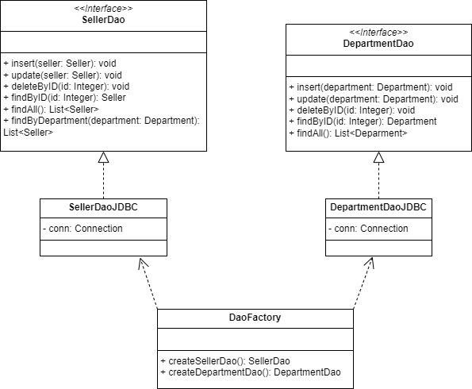

# Workshop JavaFX JDBC

## Modelagem

  

## Camadas do Projeto

  

### Descrição
1. **Domínio**: 
   - Classes principais (entidades).

2. **Acesso ao banco de dados**: 
   - Utiliza o padrão DAO (*Data Access Object*), onde cada entidade possui um representante como interface DAO.
   - Cada DAO, por exemplo `DepartmentDAO`, é implementado com JDBC (*Java Database Connectivity*).
   - Consequentemente, cada `DaoJDBC` possui métodos implementados de CRUD (Create, Read, Update, Delete) com o banco de dados.

3. **Serviços**: 
   - Classes auxiliares que implementam as operações de CRUD definidas no padrão DAO.

4. **Interface Gráfica**: 
   - Responsável por apresentar as operações ao usuário de forma visual.

> OBS.: Abaixo segue imagem do padrão DAO utilizado no projeto.

  

## Exemplos Obtidos Através do Projeto

### Tela de Vendedores

#### Tela Geral

  

#### Tela de Cadastro

  

### Tela de Departamentos

#### Tela Geral

  

#### Tela de Cadastro

  

## Tecnologias Utilizadas

- **JDBC**: Modelo de conexão com o banco de dados.
- **Padrão DAO**: Padrão de conexão utilizado, separando adequadamente as responsabilidades de cada classe.
- **MySQL**: Banco de dados utilizado.
- **JavaFX**: Interface gráfica.

OBS.: Projeto realizado através do curso https://www.udemy.com/share/1013hw3@TENABLv70VzogDwYZLQYBDdHoximjmZ4nI05OrfsJ0VPX_QMM-FxvO8jFb_qNWBl4g==/
